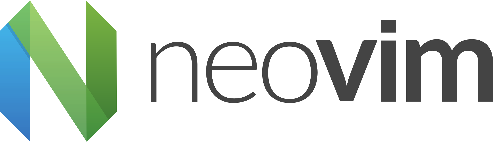

# Neovim Configuration <!-- omit in toc -->

<!-- Repo image -->
<p align="center">
  <picture>
    <source media="(prefers-color-scheme: dark)" srcset=".static/img/neovim-banner.png">
    
  </picture>
</p>

<p align="center">
  
  
  
  
</p>

My `neovim` configuration as a git repository.

🔗 [View all releases](https://github.com/redjax/neovim/releases)

*([Read more about how this repository creates releases](#releases))*

## Table of Contents <!-- omit in toc -->

- [Requirements](#requirements)
  - [Neovim version](#neovim-version)
  - [Dependencies](#dependencies)
- [Instructions](#instructions)
  - [Linux](#linux)
  - [Windows](#windows)
  - [Docker](#docker)
    - [Build the container](#build-the-container)
    - [Run the container](#run-the-container)
- [Switching profiles](#switching-profiles)
  - [Temporarily switch profiles](#temporarily-switch-profiles)
    - [Linux](#linux-1)
    - [Windows](#windows-1)
  - [Permanently set/change default profile](#permanently-setchange-default-profile)
    - [Linux](#linux-2)
    - [Windows](#windows-2)
- [Updating](#updating)
  - [Linux](#linux-3)
  - [Windows](#windows-3)
- [Notes](#notes)
  - [Configure LSP (Language Server)](#configure-lsp-language-server)
- [Fix Github rate limit with Lazy](#fix-github-rate-limit-with-lazy)
  - [Personal Access Token (PAT)](#personal-access-token-pat)
  - [.netrc file](#netrc-file)
- [Releases](#releases)
- [Links](#links)

## Requirements

### Neovim version

Minimum: `v0.11.0`

*check with `nvim --version`*

### Dependencies

> [!WARNING]
> The Linux install script(s) do not support LXC container environments or ARM CPUs.
> 
> I have access to both of these environments and will develop the configuration for those platforms,
but until this message is removed, LXC containers and ARM CPUs are not supported.

If you install `neovim` using one of the [install/setup scripts](./scripts/), the dependencies for my `neovim` configuration will be installed automatically.

Otherwise, requirements for this configuration are:

- [Kickstart.nvim dependencies](https://github.com/nvim-lua/kickstart.nvim?tab=readme-ov-file#install-external-dependencies)
  - `git`
  - `make` / `CMake`
  - `unzip`
  - `gcc`
  - [`ripgrep`](https://github.com/BurntSushi/ripgrep#installation)
  - `xclip` / `win32yank`
  - A [Nerd Font](https://www.nerdfonts.com/)
    - The setup scripts install `FiraCode` Nerd Fonts
- `nodejs`/`npm`
  - The setup scripts install `nodejs-lts` with the [Node Version Manager (`nvm`)](https://github.com/nvm-sh/nvm) on Linux, and `nodejs-lts` via [`scoop`](https://scoop.sh) on Windows.
- Languages for Neovim LSP (all optional, except Node)
  - Python
  - Go
  - Node
  - Lua / Luarocks

## Instructions

- Clone repository with `git clone git@github.com:redjax/neovim` (or with HTTPS: `git clone https://github.com/redjax/neovim ./neovim`)
- Run the setup script for your platform:
  - [Linux](#linux)
  - [Windows](#windows)
- Run `nvim` to ensure everything installed correctly.

### Linux

The [Linux setup script](./scripts/linux/install.sh) installs & configures `neovim` and any dependencies needed to build/configure/run the program. The script also creates a symlink of each Neovim configuration in the [`config/` directory](./config/) to the `~/.config/{neovim-config-name}` path on the host.

Run `./scripts/linux/install.sh` to install `neovim` and its dependencies.

### Windows

The [Windows setup script](./scripts/windows/install-neovim-win.ps1) installs the [`scoop` package manager](https://scoop.sh), then installs all `neovim` requirements (including `nodejs-lts`) with it. `neovim` itself is installed with `scoop` using this script.

I chose `scoop` over other options like `winget` and `chocolatey` because every dependency I need is there, the setup is simple, and it keeps everything contained to a path instead of throwing shit all over the OS's `$PATH`.

- Run [`./scripts/windows/install-neovim-win.ps1`](./scripts/windows/install-neovim-win.ps1)
  - **NOTE**: Windows requires Administrator priviliges to create path junctions. If you use the [Windows setup script](./scripts/windows/install-neovim-win.ps1), the junction will call the `Run-AsAdmin` command if the script is not running in an elevated session; you may see a UAC prompt, have to type a password, or you might see a blue Powershell window flash on the screen for a moment.

### Docker

This repository includes Docker images for building Neovim with my custom config in a container environment. The Dockerfiles can be found in the [containers/](./containers/) path. For example, [`deb.Dockerfile`](./containers/deb.Dockerfile) builds `neovim` on a Debian base and installs the configuration for Debian.

The containers set up an environment to run [`install.sh`](./scripts/linux/install.sh), and can be used to test my `neovim` setup across multiple platforms.

#### Build the container

To build the container, run the [`build-deb-img.sh`](./scripts/docker/build-deb-img.sh) (for Debian) or [`build-rpm-img.sh`](./scripts/docker/build-rpm-img.sh) (for Fedora) script.

For example, the `build-deb-img.sh` script (note: you should run this script from the root of the repository):

```shell
./scripts/docker/build-deb-img.sh
```

You can also manually build the command (note: add `--progress=plain` to the end of the docker build command to see all build output):

```shell
## Enable CONTAINER_ENV and set a build path for Neovim before running container
#  This example builds the deb.Dockerfile Debian container environment
CONTAINER_ENV=1 NEOVIM_MAKE_BUILD_DIR="/tmp/build" docker build -f ./containers/deb.Dockerfile -t neovim-buildtest .
```
#### Run the container

After building the Docker container, you can run it with:

```shell
docker exec --rm -it nvim-buildtest /bin/bash
```

Once you're in the container, open neovim with `nvim`. The `Lazy` installer should kick off and build the configuration. After this first execution, each subsequent run will launch immediately, until the container is rebuilt.

## Switching profiles

The install scripts create symbolic links to each configuration in the [`config/` directory](./config). By default, running `nvim` will open the configuration at `~/.config/nvim` (or `$env:LOCALAPPDATA\nvim` on Windows).

You can have Neovim open a different configuration by setting the `NVIM_APPNAME` environment variable.

### Temporarily switch profiles

#### Linux

Prepend your `nvim` command with `NVIM_APPNAME=`:

```bash
NVIM_APPNAME=nvim-configname nvim
```

Use an existing configuration name, i.e. [`nvim-kickstart`](./config/nvim-kickstart/) or [`nvim-noplugins`](./config/nvim-noplugins/).

#### Windows

In a Powershell prompt, run:

```powershell
$NVIM_APPNAME=nvim-configname

nvim
```

Use an existing configuration name, i.e. [`nvim-kickstart`](./config/nvim-kickstart/) or [`nvim-noplugins`](./config/nvim-noplugins/).

### Permanently set/change default profile

If you export the `NVIM_APPNAME` environment variable globally, you can set the configuration Neovim will use whenever you run `nvim`. You can still [temporarily override the profile](#temporarily-switch-profiles).

#### Linux

Export the `NVIM_APPNAME` environment variable, i.e. by putting the following in your `~/.bashrc`:

```bash
NVIM_APPNAME="nvim-configname"
```

Use an existing configuration name, i.e. [`nvim-kickstart`](./config/nvim-kickstart/) or [`nvim-noplugins`](./config/nvim-noplugins/).

#### Windows

On Windows, you can set this environment variable by hitting the Start button, searching for "environment variables," and opening the option to edit the user's environment variables. Then, create a new variable called `NVIM_APPNAME`, and set the value to the configuration you want to use, i.e. `nvim-noplugins`.

You can also do this with an elevated Powershell prompt using `setx`:

```powershell
setx NVIM_APPNAME "nvim-configname"
```

Use an existing configuration name, i.e. [`nvim-kickstart`](./config/nvim-kickstart/) or [`nvim-noplugins`](./config/nvim-noplugins/).

## Updating

To get the latest stable version of the configuration, run `git switch main && git pull`. For the latest development release, run `git switch dev && git pull`.

### Linux

Run `sudo rm $(which nvim)`, then re-run the [Linux install script at `./scripts/linux/install.sh `](./scripts/linux/install.sh). This will re-install the latest version of Neovim from source.

### Windows

Update Neovim using whichever installer you used.

- Github release: [download & install latest release](https://github.com/neovim/neovim/releases/latest)
- Winget: Run `winget update Neovim.Neovim`
- Scoop: Run `scoop update neovim`
- Chocolatey: Run `choco upgrade neovim`

## Notes

- View available colorschemes by opening neovim and running `:Telescope colorscheme`
- Press `<Space>` to open an interactive menu
- Run `:Lazy` to open the package manager

### Configure LSP (Language Server)

Configuring a language server (LSP) with Lazy and Mason is pretty simple. [Find a language server here](https://github.com/neovim/nvim-lspconfig/blob/master/doc/configs.md), for example the [`marksman` Markdown LSP](https://github.com/neovim/nvim-lspconfig/blob/master/doc/configs.md#marksman).

In your [`init.lua`](./config/nvim/init.lua), find the line that begins with `require('lazy').setup({`. Within that function, find the section that begins with the comment `-- Main LSP Configuration`. In that section, in the `config = function()` function, find the variable `local servers = {`.

Configure your LSPs Within the `local servers = {}` mapping, referencing existing LSPs for setup. After finding an LSP from the list, find the setup instructions and the `Default config:` section.

For example, the `marksman` default config looks like:

* `cmd` :
> `{ "marksman", "server" }`
* `filetypes` :
> `{ "markdown", "markdown.mdx" }`
* `root_markers` :
> `{ ".marksman.toml", ".git" }`

To configure a new LSP with Mason, you just need to add some setup instructions:

```lua
-- Markdown https://github.com/neovim/nvim-lspconfig/blob/master/doc/configs.md#marksman
marksman =  {
  cmd = { "marksman", "server" },
  filetypes = { "markdown", "markdown.mdx" },
  root_markers = { ".marksman.toml", ".git" }
},
```

Next time you run `nvim`, Mason will install the LSP and `neovim` will use it when an appropriate file is opened.

## Fix Github rate limit with Lazy

Github [rate limits unauthenticated requests at 60/hour](https://docs.github.com/en/rest/using-the-rest-api/rate-limits-for-the-rest-api?apiVersion=2022-11-28). If you hit this rate limit, Lazy will fail to install/update packages with an error like:

```shell
clone failed
Cloning into 'C:/Users/jack/AppData/Local/nvim-data/lazy/mason'...
remote: Repository not found.
fatal: repository 'https://github.com/mason-org/mason.git/' not found
```

To fix this, you can configure a [Github Personal Access Token (PAT)](https://docs.github.com/en/authentication/keeping-your-account-and-data-secure/managing-your-personal-access-tokens) and set it in your environment or a `.netrc` file in your home directory.

### Personal Access Token (PAT)

Set an environment variable `GITHUB_TOKEN` in your environment. You can run one of the commands below to set your token for the current terminal session, but when you close that session the variable will be reset. Add it to your `~/.bashrc` on Linux, or your Windows user's environment.

Temporarily set a token on Linux:

```bash
export GITHUB_TOKEN=ghp_your_personal_access_token
```

Temporarily set a token on Windows:

```powershell
$env:GITHUB_TOKEN = "ghp_your_personal_access_token"
```

To set the environment variable permanently on Windows, you can run:

```powershell
[System.Environment]::SetEnvironmentVariable("GITHUB_TOKEN", "ghp_your_token", "User")
```

### .netrc file

You can also create a `~/.netrc` file with the following contents:

```plaintext
machine github.com
login your_github_username
password ghp_your_personal_access_token
```

## Releases

This repository releases .zip archives of the [neovim configurations in `config/`](./config). The [release pipeline](./.github/workflows/release.yml) is triggered manually, and creates the next patch version automatically (i.e. `v0.0.1` -> `v0.0.2`).

Each time a release is created, it will contain .zip archives of each configuration, named after the directory (i.e. `nvim-v0.0.1.zip` for the [default `nvim/` config](./config/nvim/)). When you extract the archive, a directory named `nvim/` will be created, containing the configuration you downloaded. You can move this file to the Neovim configuration path (`~/.config/nvim` on Linux, `%USERPROFILE%\AppData\Local\nvim` on Windows) to install the configuration. You can also extract the .zip archive directly to that path to extract & install in 1 step.

## Links

- [Github: kickstart.nvim](https://github.com/nvim-lua/kickstart.nvim)
- [Github: lazy.nvim](https://github.com/folke/lazy.nvim)
- [LazyVim Docs](https://lazy.folke.io)
- [Github: Awesome Neovim](https://github.com/rockerBOO/awesome-neovim)
  